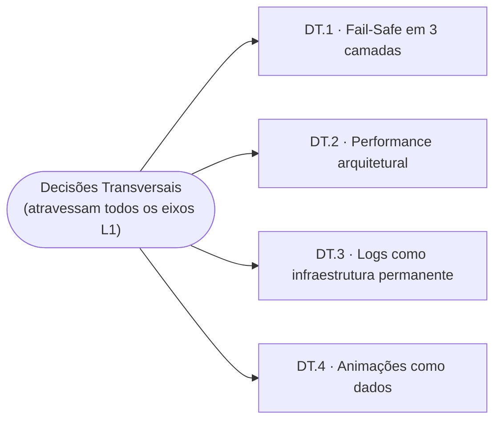

# Árvore de Design — Swift Svelte Model View Architecture

> Mapa causal de decisões de design: cada nó é uma escolha feita entre alternativas, com racional explícito. Nós-pai constrangem ou habilitam nós-filho — a estrutura da árvore torna visível a lógica do design.
>
> Conceito: Frederick P. Brooks, *The Design of Design* (2010).

---

## Status

- [x] Passo 1 — Esqueleto + Nó Raiz
- [x] Passo 2 — L1: Os Quatro Eixos Estruturais
- [x] Passo 3 — L2: Paradigma MV
- [x] Passo 4 — L2: Propriedade de Estado
- [x] Passo 5 — L2: Superfície de API
- [x] Passo 6 — L2: Processo de Desenvolvimento
- [x] Passo 7 — Decisões Transversais
- [x] Passo 8 — Diagrama Geral + Revisão Final

---

## Convenção de Nós

Cada nó de decisão segue o formato:

> **Decisão:** o que foi escolhido
> **Alternativas:** o que foi rejeitado
> **Racional:** por que esta escolha, e não as outras
> **Habilita / Constrange:** quais decisões downstream isso abre ou fecha

---

## Nó Raiz

**Decisão:** Construir uma arquitetura de componentes UI — chamada SSMV — que seja o elo comum entre o desenvolvimento Svelte/web e o desenvolvimento Swift/SwiftUI. Um desenvolvedor que trabalha nos dois ecossistemas deve encontrar o mesmo modelo mental, o mesmo workflow, a mesma separação de responsabilidades e as mesmas práticas de desenvolvimento nos dois lados — não a mesma sintaxe, não a mesma API, mas o mesmo raciocínio de design.

A equivalência não é superficial. Não se afirma que "adicionar um modifier em Svelte é idêntico a adicionar um View Modifier em SwiftUI". Afirma-se que o *porquê* de um modifier existir, o *papel* que ele cumpre na arquitetura, a *forma* como o estado flui, e o *processo* pelo qual o código é desenvolvido e verificado são os mesmos nos dois contextos — respeitando as diferenças inerentes de linguagem e ecossistema.

**Alternativas:**
- Adotar os idiomas do React (hooks, reducers, stores, context como prop-drilling curto) — amplamente documentado, mas estruturalmente diferente do paradigma Apple, quebrando o elo entre os dois ecossistemas.
- Adotar MVC clássico — familiar para quem vem de web tradicional, mas introduz um "mediador" que toma decisões, papel inexistente no SwiftUI moderno.
- Construir um wrapper fino sobre um framework existente (ex: Pinia, XState) — reduz surface de decisão, mas acopla a arquitetura às convenções e limitações do framework escolhido, afastando-a do modelo mental Apple.
- Seguir os idiomas nativos do Svelte sem arquitetura explícita — válido para projetos simples, mas não produz o elo procurado: idiomas nativos do Svelte e idiomas nativos do SwiftUI são diferentes.

**Racional:** O esforço é de criação, não de tradução — SSMV não é "SwiftUI portado para a web", tampouco é "Svelte com nomes Apple". É uma arquitetura própria, projetada deliberadamente para que o modelo mental seja transferível nos dois sentidos: um desenvolvedor que vem do SwiftUI encontra papéis e fluxos familiares; um desenvolvedor que vem do SSMV e começa no SwiftUI encontra a mesma estrutura de pensamento. A consistência de modelo mental reduz carga cognitiva e produz DX e UX melhores em ambos os lados simultaneamente.

**Habilita / Constrange:**
- Habilita a escolha de MV (não MVC) como paradigma — porque SwiftUI usa MV, e a equivalência exige o mesmo paradigma, não apenas nomes parecidos.
- Habilita o Coordinator com papel análogo ao `UIViewRepresentable.Coordinator` do SwiftUI — bridge entre o mundo declarativo e o imperativo, sem tomar decisões.
- Constrange a API pública a padrões análogos a View Modifiers do SwiftUI — factories que concedem capacidades sem alterar a estrutura do componente consumidor.
- Constrange o processo de desenvolvimento a spec comportamental → contrato de interface → TDD — equivalente ao design-by-contract do ecossistema Apple.

---

## L1 — Os Quatro Eixos Estruturais

O Nó Raiz habilita quatro decisões de primeiro nível. Cada uma define um eixo estrutural independente — juntas, formam o espaço de design dentro do qual todas as decisões de nível L2 vivem.

---

### L1.1 — Paradigma: MV, não MVC

**Decisão:** Adotar Model–View como paradigma. Não há Controller, não há mediador. O Coordinator existe, mas não é um "C" do MVC — ele não toma decisões, não rota eventos, não media entre partes.

**Alternativas:**
- MVC clássico (Controller como mediador) — o Controller recebe eventos da View, decide o que fazer, e instrui o Model. Isso cria acoplamento bidirecional: o Controller precisa conhecer tanto a View quanto o Model.
- MVP (Model–View–Presenter) — o Presenter tem referência à View e a atualiza diretamente. O fluxo é mais testável que MVC, mas ainda requer que o Presenter conheça a abstração da View.
- MVVM (Model–View–ViewModel) — o ViewModel expõe estado transformado para a View via bindings. Mais próximo do MV, mas o ViewModel tende a acumular lógica de apresentação e de negócio misturadas.

**Racional:** SwiftUI usa MV — a View observa o Model diretamente, sem intermediários. O Coordinator desta arquitetura é um análogo ao `UIViewRepresentable.Coordinator` do SwiftUI: faz bridge entre o mundo declarativo e o imperativo, mas não decide nada. Manter MV preserva o modelo mental e elimina a classe inteira de bugs onde o mediador acumula estado derivado inconsistente com o Model. MV é: uma única fonte de verdade (Model) + projeções sem estado (View) = zero problemas de sincronia.

**Habilita / Constrange:**
- Constrange o Coordinator a ter um papel exclusivamente executivo — ele obedece o Model, nunca decide. *(→ L2.3.1)*
- Habilita o Model a ser testável em isolamento total — nenhum outro módulo precisa estar presente para testar lógica de negócio. *(→ L2.6.3)*
- Constrange o fluxo de dados a ser unidirecional: Interaction → Model → Coordinator. *(→ L2.3.3)*

---

### L1.2 — Propriedade de Estado: Model como fonte única da verdade

**Decisão:** O Model é o único lugar onde estado e regras de negócio vivem. Ele expõe estado como somente-leitura para o exterior. Nenhum outro módulo mantém estado derivado do domínio.

**Alternativas:**
- Estado distribuído entre módulos — Coordinator mantém parte do estado, Interaction mantém parte. Permite otimizações locais, mas cria múltiplas fontes de verdade que precisam ser sincronizadas.
- Stores globais (ex: Svelte stores, Pinia, Zustand) — estado acessível globalmente via subscription. Conveniência alta, mas quebra o isolamento entre instâncias e torna a testabilidade dependente de reset de estado global entre testes.
- Estado imutável com reducers (ex: Redux) — cada mudança de estado é uma transformação pura. Altamente previsível, mas introduz indireção (action dispatch) onde chamadas de método diretas seriam suficientes e mais legíveis.

**Racional:** Ter uma única fonte de verdade elimina a classe de bugs de sincronização entre módulos. O Model imperativo (mutação direta de campos privados) é mais legível e rastreável que dispatch de actions — a pilha de chamadas aponta diretamente para quem mudou o quê. A exposição somente-leitura protege o estado de corrupção externa sem o overhead de imutabilidade total.

**Habilita / Constrange:**
- Habilita que Coordinator e Interaction sejam stateless em relação ao domínio — eles não precisam saber o estado atual para fazer seu trabalho; o Model já está atualizado. *(→ L2.4)*
- Constrange a comunicação Coordinator→Model a não existir — o Coordinator não reporta estado de volta ao Model; ele apenas executa. *(→ L2.3.4)*
- Habilita múltiplas instâncias independentes na mesma página — cada instância tem seu próprio Model. *(→ L2.4.3)*

---

### L1.3 — Superfície de API: factories, não wrappers

**Decisão:** A API pública dos pacotes é exposta como factory functions que retornam handles — não como componentes wrapper que envolvem o conteúdo do consumidor no DOM.

**Alternativas:**
- Componentes wrapper (ex: `<Movable>
conteúdo
</Movable>`) — familiar, mas insere elementos intermediários no DOM que interferem com CSS selectors, flexbox gaps, e grid layouts.
- Diretivas / `use:action` do Svelte — mais próximo de zero-overhead, mas sem reatividade: não re-executam quando dependências mudam; estado reativo não é acessível no `<script>` diretamente.
- Class components com `bind:this` — exige que o consumidor declare uma variável de referência e espere o mount para chamar métodos. A referência é nullable até o mount, exigindo guards.

**Racional:** Factories sem wrappers é o análogo web ao View Modifier do SwiftUI (`.draggable()`, `.focusable()`): a capacidade é concedida ao elemento existente do consumidor, sem alterar a árvore de componentes. Zero overhead de componente, zero impacto no layout, composição natural de múltiplas capacidades no mesmo elemento.

**Habilita / Constrange:**
- Habilita que o handle exponha estado reativo acessível diretamente no `<script>` da View consumidora — sem necessidade de `bind:this` ou esperar mount. *(→ L2.5.1)*
- Constrange Context e Modifier a serem ambos factories — não há distinção de tipo de componente entre os dois. *(→ L2.5.2)*
- Habilita composição de múltiplas capacidades no mesmo elemento via múltiplos `{@attach}` lado a lado. *(→ L2.5)*

---

### L1.4 — Processo de Desenvolvimento: spec comportamental antes de tudo

**Decisão:** O desenvolvimento de cada pacote segue a sequência: Behavioral Spec → Interface.md → Implementação (TDD) → Checklist de conformidade. Nenhuma implementação começa sem spec e contrato público escritos.

**Alternativas:**
- Implementação direta com testes retroativos — comum em projetos com pressão de tempo, mas produz specs implícitas no código que são difíceis de auditar e frequentemente incompletas.
- Spec técnica (definindo classes, métodos, tipos) antes da implementação — captura o *como*, não o *o quê*. Uma spec técnica fica obsoleta assim que o design de implementação muda.
- README-driven development (escrever docs públicas antes do código) — captura a API, mas não os comportamentos internos (estados, transições, edge cases) que guiam a implementação TDD.

**Racional:** A Behavioral Spec descreve *o que o sistema faz* sem nomear tecnologia, classes ou métodos. Isso garante que a spec sobreviva a refatorações de implementação e continue sendo o árbitro de correção. A Interface.md transforma os comportamentos da spec em um contrato de uso concreto — forçando decisões explícitas sobre o que é público antes que o código as tome por acidente. A sequência completa garante que implementação, contrato e conformidade arquitetural sejam verificados antes de qualquer commit.

**Habilita / Constrange:**
- Constrange os testes a derivar do Behavioral Spec, não do código — testes verificam contratos comportamentais, não implementações. *(→ L2.6.1)*
- Habilita a Interface.md como árbitro de divergência — se implementação e Interface.md divergem, a implementação está errada. *(→ L2.6.2)*
- Constrange o Behavioral Spec a não conter nomes de tecnologia, classes ou métodos — deve sobreviver a qualquer refatoração de implementação. *(→ L2.6.1)*

---

## L2 — Paradigma MV

Decisões constrangidas por **L1.1** (MV, não MVC). O fato de não haver mediador exige que cada módulo tenha um papel preciso e que o fluxo de informação entre eles seja explicitamente definido.

---

### L2.3.1 — Papel do Coordinator: bridge DOM, nunca tomador de decisões

**Decisão:** O Coordinator é responsável exclusivamente por executar efeitos no DOM em resposta ao estado do Model. Ele não contém lógica condicional de negócio — não decide *se* deve agir, apenas *como* executar a ordem que o Model já tomou.

**Alternativas:**
- Coordinator com lógica condicional própria — verifica condições adicionais antes de agir (ex: "só anima se o elemento estiver visível"). Parece pragmático, mas duplica lógica de negócio fora do Model, criando uma segunda fonte de verdade implícita.
- Coordinator como observer passivo que apenas aplica transforms — sem métodos explícitos, só reage a cada mudança de estado. Mais simples, mas perde a capacidade de expressar contratos testáveis com nomes claros.

**Racional:** Se o Coordinator tomasse decisões, o comportamento do sistema dependeria de dois lugares: o Model (que decide as regras) e o Coordinator (que decide se aplica). Testes do Model passariam mas o comportamento real falharia — o isolamento de falhas, que é uma das maiores vantagens da arquitetura, se perderia. O Coordinator recebe intenções tipadas (discriminated unions) do Model — a decisão já está embutida na intenção, não há espaço para interpretação.

**Habilita / Constrange:**
- Habilita múltiplos Coordinators observando o mesmo Model independentemente — cada um executa sua responsabilidade de DOM sem interferir nos outros.
- Constrange o Model a expressar *intenções completas* em vez de simples booleans — o Coordinator precisa receber a ordem completa para executar sem inferir. *(→ L2.4.2)*

> **Padrão de escrita decorrente:** Como o Coordinator não contém lógica condicional de negócio, o corpo de cada método se torna uma sequência plana de operações DOM. Esse espaço naturalmente se organiza agrupando ações por tipo de concern: primeiro acessibilidade (atributos ARIA, roles), depois data attributes (estado observável para CSS), depois efeitos visuais (animação, transform). O agrupamento não é uma regra nova — é a forma que emerge quando um método executa sem decidir.

---

### L2.3.2 — Papel da Interaction: tradutor de hardware, nunca processador de input

**Decisão:** A Interaction é responsável exclusivamente por capturar eventos de hardware (pointer, keyboard, touch) e traduzi-los em informações semânticas para o Model. Ela não conhece coordenadas CSS, porcentagens, redimensionamento de janela, ou qualquer estado de domínio.

**Alternativas:**
- Interaction com conhecimento parcial do domínio — ex: calcula a posição relativa ao container antes de passar ao Model. Parece uma otimização, mas acopla a Interaction ao contexto de layout, tornando-a não-reutilizável em outros contextos geométricos.
- Interaction que chama métodos do Coordinator diretamente para feedback imediato — ex: muda o cursor sem passar pelo Model. Elimina a latência de um ciclo reativo, mas quebra o fluxo unidirecional e cria acoplamento direto entre Interaction e Coordinator.
- Absorver a Interaction dentro do Coordinator — um único módulo escuta eventos e manipula o DOM. Mais simples para casos triviais, mas impossibilita a substituição de input device sem refatorar o Coordinator inteiro.

**Racional:** A Interaction é uma *barreira sanitária*. Toda a "sujeira" de `addEventListener`, `getBoundingClientRect` e coordenadas de ponteiro vive e morre nela. O Model permanece matematicamente puro — seus métodos recebem dados semânticos (deltas, posições absolutas, flags), nunca dados de hardware bruto. Isso é o que torna o Model testável sem DOM e a Interaction substituível sem alterar uma linha do Model.

**Habilita / Constrange:**
- Habilita que o Model seja testado com dados sintéticos diretos, sem simulação de eventos DOM. *(→ L2.6.3)*
- Habilita a substituição de `DragInteraction` por `KeyboardInteraction` no mesmo Model sem alterar nenhuma linha de lógica de negócio. *(→ L2.3.5)*
- Constrange os métodos do Model a receber apenas dados agnósticos de hardware — nunca `event.clientX`, `event.key`, ou qualquer dado de hardware bruto. *(→ L2.4)*

---

### L2.3.3 — Fluxo de dados: unidirecional e obrigatório

**Decisão:** O fluxo de dados segue estritamente a direção: **Interaction → Model → Coordinator**. Nenhum módulo comunica-se com os outros dois diretamente, e nenhum fluxo reverso é permitido.

**Alternativas:**
- Fluxo bidirecional Coordinator→Model — o Coordinator reporta medições DOM de volta ao Model (ex: dimensões do elemento após resize). Parece necessário, mas pode ser resolvido de outra forma: o Coordinator atualiza seu próprio estado local de DOM e o Model consulta via interface quando precisa.
- Interaction com acesso de leitura ao Model — para tomar decisões sobre como traduzir o input (ex: "o elemento está no canto? então bloqueia movimento para a esquerda"). Mas essa lógica é de negócio — pertence ao Model, não à Interaction.
- Comunicação direta Interaction→Coordinator — para feedback visual imediato sem latência de um ciclo de estado. O custo é acoplamento que elimina a independência dos módulos.

**Racional:** Um fluxo unidirecional garante que haja exatamente um lugar para cada tipo de problema. Um bug de estado está no Model. Um bug de DOM está no Coordinator. Um bug de captura de input está na Interaction. O diagnóstico é O(1): a camada que falhou é a camada responsável. Fluxos bidirecionais criam ciclos de causa difíceis de rastrear e tornam a ordem de execução dependente do timing reativo.

**Habilita / Constrange:**
- Habilita diagnóstico de falha por camada — se os testes do Model passam mas o comportamento visual falha, o bug está no Coordinator ou na View. *(→ L2.6.3)*
- Constrange o Coordinator a nunca chamar métodos do Model — ele apenas observa estado. *(→ L2.3.4)*

---

### L2.3.4 — Observação assimétrica: Coordinator observa o Model, Model não conhece o Coordinator

**Decisão:** O Coordinator observa o estado reativo do Model e reage a mudanças. O Model nunca mantém referências a Coordinators, nunca chama métodos deles, e não tem conhecimento da existência deles.

**Alternativas:**
- Model notifica Coordinators via callbacks registrados — o Model mantém uma lista de observers e os notifica em cada mudança de estado. Familiar (padrão Observer), mas exige gerenciamento explícito de registro/remoção e cria referências mútuas.
- Model emite eventos que o Coordinator escuta — desacopla a referência direta, mas requer um barramento de eventos que precisa ser inicializado, gerenciado e destruído.
- Coordinator recebe o estado como props imutáveis a cada render — o modelo de componentes declarativos tradicionais. Funciona para Views, mas Coordinators precisam de side effects imperativos — não de re-renderização.

**Racional:** A observação unilateral garante que o Model seja completamente agnóstico de quantos Coordinators existem, de quais tipos são, e de se existem. A direção da dependência segue a direção da autoridade: o Model é a autoridade, os Coordinators são dependentes.

**Habilita / Constrange:**
- Habilita que Coordinators sejam criados, destruídos e substituídos sem alterar o Model.
- Habilita que o Model seja instanciado e testado sem nenhum Coordinator presente.

---

### L2.3.5 — Plugabilidade e agnoscismo são princípios universais

**Decisão:** Cada módulo que serve o Model (Interaction, Coordinator) é projetado para ser substituível sem alterar o Model. O Model declara as interfaces que esses módulos devem satisfazer — não o contrário. O princípio é aplicado em dois eixos:

- **Agnoscismo de conteúdo:** um pacote é agnóstico do conteúdo específico que recebe. O `AttentionRequester` aceita qualquer animação que satisfaça o contrato `ARAnimation` — nunca conhece `BounceAnimation` ou `ShakeAnimation` pelo nome. O `Movable` aceita qualquer Interaction que satisfaça `MovableInteraction` — nunca conhece `DragInteraction` ou `KeyboardInteraction` diretamente.

- **Agnoscismo de implementação entre módulos:** o Model não conhece a implementação concreta dos módulos que o servem. O `MovableModel` implementa `MovableInteraction` e expõe esse contrato — qualquer Interaction que o receba pode chamá-lo sem saber o tipo real. O `AttentionRequesterModel` declara `AttentionRequesterCoordinator` — qualquer Coordinator que satisfaça esse contrato pode ser plugado sem que o Model precise mudar.

**Alternativas:**
- Acoplamento direto ao tipo concreto — o Model recebe `DragInteraction` diretamente, não uma interface. Mais simples para um único caso, mas elimina a substituibilidade por definição.
- Interface global compartilhada entre pacotes — um tipo `Interaction` ou `Coordinator` reutilizável. Parece DRY, mas força interfaces mais genéricas do que o necessário e cria acoplamento entre pacotes que deveriam ser independentes.
- Plugabilidade só nas Interactions — o Coordinator permanece acoplado ao Model concreto. Resolve o caso de múltiplos dispositivos de input, mas não o caso de múltiplas estratégias de execução DOM.

**Racional:** O consumidor da interface é quem declara o contrato — não o fornecedor. O Model é o módulo de maior valor (contém as regras de negócio); os módulos que o servem são de menor valor (adaptadores). Essa inversão de dependência significa que uma `KeyboardInteraction` pode ser escrita sem saber que `MovableModel` existe, e que um Coordinator alternativo pode ser plugado sem alterar uma linha de lógica de negócio. Interfaces locais por pacote garantem que cada contrato seja mínimo e preciso para o domínio que serve.

Além da flexibilidade técnica, o design com contratos explícitos desde a v1 reflete uma postura de projeto: os pacotes são construídos prevendo uso amplo, não reatividade a pedidos futuros. O protocolo de animações do `AttentionRequester` não foi introduzido quando surgiu a segunda animação — existia desde o início, porque o contrato expressa a intenção do pacote ("anima qualquer coisa que saiba se apresentar"), não apenas o que foi implementado até agora. Contratos precoces custam pouco e abrem espaço; retroencaixar contratos em código acoplado custa muito.

Contratos entre módulos também são o que torna o isolamento de testes possível sem mocks arbitrários. O Model pode ser instanciado e testado sem nenhum Coordinator ou Interaction presente. O Coordinator pode ser testado com um stub tipado pela interface do Model — sem o Model real. A Interaction pode ser testada com um stub que implementa `MovableInteraction` — sem o pacote inteiro. Cada módulo tem seu contrato; cada contrato tem seus testes; os testes de um módulo não dependem dos outros.

Isso é o mesmo modelo mental de comportamento→contrato→testes→implementação que governa o pacote como um todo — aplicado agora a nível de módulo. O Behavioral Spec e o `Interface.md` são os contratos públicos do pacote; as interfaces declaradas pelo Model (`MovableInteraction`, `AttentionRequesterCoordinator`) são os contratos privados entre os módulos internos. A disciplina é a mesma; a escala é diferente.

**Habilita / Constrange:**
- Habilita a criação de novas Interactions e Coordinators sem alterar o Model.
- Constrange cada pacote a definir suas próprias interfaces locais — não existe tipo global `Interaction` ou `Coordinator` compartilhado.
- Constrange o design do Model a expor apenas o que os módulos serventes genuinamente precisam — interfaces mínimas, não APIs completas.

---

## L2 — Propriedade de Estado

Decisões constrangidas por **L1.2** (Model como fonte única da verdade). O fato de o Model deter todo o estado e todas as regras exige que sua API de exposição, seus mecanismos de proteção e sua organização para ecossistemas multi-componente sejam definidos com precisão.

---

### L2.4.1 — Estado interno mutável, superfície pública somente-leitura

**Decisão:** O estado interno do Model é mutável e privado — alterado diretamente por chamadas de método, sem indireção. A superfície pública expõe esse estado como somente-leitura: propriedades derivadas que refletem o estado interno mas não podem ser escritas por consumidores externos.

**Alternativas:**
- Estado totalmente imutável com transformações puras (estilo Redux/Elm) — cada mudança produz um novo objeto de estado. Altamente previsível e auditável via time-travel, mas introduz overhead de alocação e uma camada de indireção (dispatch de action) onde uma chamada de método direta seria mais legível e suficiente.
- Estado público mutável — consumidores podem escrever diretamente em propriedades do Model. Simples, mas elimina o encapsulamento: qualquer parte do sistema pode colocar o Model em um estado inválido, e o diagnóstico de corrupção de estado se torna O(n) — qualquer caller é suspeito.
- Getters tradicionais sem derivação reativa — expõe estado como funções de acesso. Funcional, mas perde a capacidade de participar do grafo reativo do framework: Views e Coordinators não recebem notificação automática de mudança.

**Racional:** A mutação direta de campos privados é o padrão de classes imperativas do Swift — legível, rastreável pela pilha de chamadas, e sem cerimônia de dispatch. O encapsulamento via somente-leitura pública garante que o Model seja o único agente que pode invalidar seu próprio estado: se o estado está corrompido, o bug está no Model, não em um caller externo. Propriedades derivadas reativas permitem que Views e Coordinators observem mudanças sem polling e sem registro explícito de listeners.

**Habilita / Constrange:**
- Habilita que testes do Model verifiquem estado através da superfície pública somente-leitura — sem acesso a internos, sem reflexão, sem backdoors de teste.
- Constrange toda lógica que muda estado a ser um método do Model — não há atalho para alterar estado de fora.

---

### L2.4.2 — Intenções tipadas em vez de booleans

**Decisão:** Quando um estado pode resultar em comportamentos qualitativamente diferentes no Coordinator, o Model expõe uma union discriminada que carrega a intenção completa — não um boolean que o Coordinator precisaria interpretar.

**Alternativas:**
- Boolean + método separado para parâmetros — o Coordinator verifica `isPaused` e depois chama `getPauseParameters()` para obter detalhes. Funciona, mas exige que o Coordinator faça duas leituras e assuma que ambas são consistentes no mesmo ciclo reativo.
- Callback no Model que o Coordinator registra — o Coordinator passa uma função que o Model chama com os parâmetros necessários. Resolve o problema de consistência, mas inverte a direção de dependência: o Model passaria a conhecer e chamar o Coordinator. *(contradiz L2.3.4)*
- Enum sem payload (apenas `idle | paused | running`) — descreve o estado, mas não carrega os parâmetros necessários para a execução. O Coordinator precisaria buscar esses parâmetros em outra propriedade do Model.

**Racional:** O Coordinator não decide — ele executa. Para executar sem decidir, ele precisa receber a ordem completa: não apenas "pausar", mas "pausar com `freeze`" ou "pausar com `resume` em 300ms". A union discriminada é a estrutura de dados que expressa exatamente isso: o tipo carrega tanto a intenção quanto os parâmetros, e o TypeScript enforça que o Coordinator trate todos os casos em compile time. O resultado é um Coordinator que é literalmente incapaz de esquecer um caso — o compilador não deixa.

**Habilita / Constrange:**
- Habilita que o Coordinator seja implementado como um `switch` sobre a intenção — sem lógica condicional própria, sem estado derivado local.
- Constrange o Model a tomar todas as decisões antes de expor o estado — não há "decisão parcial" que o Coordinator complete.

---

### L2.4.3 — Sem singletons globais; isolamento por contexto para ecossistemas multi-componente

**Decisão:** Models não são singletons globais. Componentes autocontidos instanciam seu próprio Model internamente. Ecossistemas multi-componente (onde partes distintas compartilham estado) distribuem instâncias de Model via contexto de árvore de componentes — garantindo que múltiplas instâncias do ecossistema possam coexistir na mesma página sem interferência.

**Alternativas:**
- Singleton global por tipo de pacote — uma instância de `MovableModel` por aplicação. Simples de acessar de qualquer lugar, mas impossibilita ter dois ecossistemas `Movable` independentes na mesma página (ex: painel esquerdo e painel direito com listas arrastáveis separadas).
- Store global com namespace por instância (ex: por ID) — múltiplas instâncias identificadas por chave. Resolve o isolamento, mas requer gerenciamento explícito de ciclo de vida da store: criação, limpeza, risco de vazamento se a chave não for removida no unmount.
- Props drilling do Model pela árvore de componentes — o Model é instanciado no topo e passado como prop para cada filho. Funciona para árvores rasas, mas não escala para profundidade arbitrária e cria acoplamento estrutural entre os componentes.

**Racional:** O contexto de árvore de componentes é o mecanismo de injeção de dependência do framework — projetado exatamente para este caso: disponibilizar uma instância a toda uma sub-árvore sem prop drilling, com ciclo de vida atrelado ao componente provedor. Quando o componente Context é removido da tela, a instância do Model é destruída automaticamente. Múltiplas instâncias do mesmo ecossistema coexistem com isolamento completo porque cada uma vive em sua própria sub-árvore de contexto.

**Habilita / Constrange:**
- Habilita múltiplos ecossistemas independentes na mesma página sem nenhuma coordenação explícita entre eles.
- Constrange componentes autocontidos (sem necessidade de compartilhamento) a não usar contexto — o Model vive internamente, invisível para o exterior.

---

### L2.4.4 — Interfaces inter-módulo declaradas pelo Model, consumidas pelos serventes

**Decisão:** O Model não apenas implementa sua própria lógica — ele declara as interfaces de todos os módulos que o servem. Coordinator e Interaction não definem o que oferecem; eles implementam contra o que o Model declarou precisar. Esses contratos vivem junto aos tipos do Model, em arquivo separado do que é exportado ao consumidor do pacote.

**Alternativas:**
- Interfaces declaradas por quem as implementa — cada módulo declara sua própria interface e o Model a importa. Inverte a direção da dependência: o Model passa a depender dos módulos que deveriam depender dele.
- Sem interfaces explícitas — acoplamento direto aos tipos concretos. Simples inicialmente, mas elimina a testabilidade em isolamento e torna a substituição de módulos uma refatoração de tipos, não uma conformação de interface.
- Interfaces em arquivo de tipos compartilhado global — centralizadas fora de qualquer módulo. Elimina a duplicação aparente, mas desconecta o contrato da autoridade que o define, tornando ambíguo quem é responsável por mantê-lo.

**Racional:** A autoridade define o contrato. O Model é a fonte única da verdade — é ele quem sabe o que precisa do Coordinator (quais efeitos DOM executar) e o que precisa da Interaction (quais informações receber). Declarar esses contratos junto aos tipos do Model torna a leitura direta: abrir o arquivo de tipos do Model revela não só a API pública do pacote, mas também os protocolos completos de comunicação interna. Um contribuidor que lê os contratos inter-módulo entende o sistema inteiro sem abrir nenhum outro arquivo.

**Habilita / Constrange:**
- Habilita que Coordinator e Interaction sejam testados com stubs tipados pelos contratos do Model — sem o Model real, sem o pacote inteiro.
- Constrange os contratos inter-módulo a não serem exportados pelo `index.ts` — são contratos internos, invisíveis ao consumidor do pacote.

---

## L2 — Superfície de API

Decisões constrangidas por **L1.3** (factories, não wrappers). O fato de a API ser exposta como factory functions — e não como componentes ou classes instanciadas pelo framework — exige que o ponto de interação do consumidor, o ciclo de vida, e a linguagem da interface sejam definidos de forma consistente com essa escolha.

---

### L2.5.1 — Handle como ponto único de interação do consumidor

**Decisão:** A factory retorna um handle — um objeto com métodos imperativos e estado reativo. O consumidor interage com o pacote inteiramente através desse handle, no `<script>` da sua View. Não há `bind:this`, não há refs nuláveis esperando o mount, não há acesso por ID.

**Alternativas:**
- `bind:this` para acesso a métodos — o consumidor declara uma variável de referência e o framework a preenche após o mount. Familiar para quem vem de React (refs), mas a variável é `null` até o mount: todo caller precisa de um guard, e o TypeScript não consegue estreitar o tipo sem asserção.
- Acesso por contexto ou evento — o componente emite um evento com a instância no detalhe, ou expõe métodos via `setContext`. Resolve a nulabilidade, mas afasta o ponto de controle do lugar natural onde o consumidor escreve sua lógica.
- Sem API imperativa — somente props reativas de entrada e saída. Adequado para componentes puramente declarativos, mas insuficiente para comportamentos que variam entre chamadas (ex: `request(bounceAnimation)` vs `request(shakeAnimation)`).

**Racional:** O handle está disponível imediatamente na linha em que a factory é chamada — sem esperar mount, sem guards de nulabilidade. O consumidor usa métodos e lê estado no mesmo `<script>` onde escreve toda a sua lógica de apresentação. Isso alinha com a separação script/template da arquitetura *(→ L1): as regras de apresentação vivem no script; o template é só a estrutura. O handle é a extensão natural desse princípio para a API do pacote.

**Habilita / Constrange:**
- Habilita que o consumidor chame métodos e leia estado reativo do pacote sem nenhuma cerimônia de ciclo de vida.
- Constrange a factory a retornar um objeto estável desde a primeira linha do `<script>` — o handle não pode ser `null` ou `undefined` em nenhum momento.

---

### L2.5.2 — Context e Modifier são ambos factories; não há wrappers no DOM

**Decisão:** Tanto o Modifier (ex: `AttentionRequester()`, `MovableItem()`) quanto o Context (ex: `MovableContext()`) são factory functions. Nenhum dos dois insere elementos no DOM. O Modifier aplica capacidades ao elemento do consumidor via `{@attach}`; o Context demarca um escopo de estado na árvore via contexto de framework, sem markup próprio.

**Alternativas:**
- Context como componente `.svelte` que envolve filhos — `<MovableContext><slot /></MovableContext>`. Familiar e declarativo, mas insere um nó de componente na árvore que pode interferir com CSS selectors, slots aninhados, e debug de componentes.
- Modifier como componente wrapper — `<Draggable>
conteúdo
</Draggable>`. O wrapper insere um elemento intermediário no DOM (mesmo que `display: contents`) que afeta flexbox gaps, grid, e seletores CSS de filho direto.
- Modifier como diretiva `use:action` — zero overhead de componente, mas sem reatividade: não re-executa quando dependências mudam, e o estado resultante não é acessível no `<script>` sem estado intermediário explícito.

**Racional:** Factories não criam instâncias de componente nem elementos no DOM. O elemento do consumidor é o próprio alvo do Modifier — não há intermediário. O Context demarca um escopo lógico na árvore sem deixar rastro estrutural no DOM. As duas escolhas convergem no mesmo princípio: a arquitetura do pacote não deve impor estrutura na árvore do consumidor. Múltiplos Modifiers podem ser compostos no mesmo elemento com múltiplos `{@attach}` lado a lado, sem aninhamento.

**Habilita / Constrange:**
- Habilita composição de múltiplas capacidades no mesmo elemento sem nenhum elemento intermediário no DOM.
- Constrange o ciclo de vida do Modifier a ser gerido pelo `{@attach}` no elemento do consumidor — não por `onMount`/`onDestroy` externos.
- Constrange o Context a não ter markup próprio — sua única função é demarcar onde uma instância do Model passa a existir na árvore.

---

### L2.5.3 — Convenção de direcionalidade: adjetivo para entrada, prefixo `is*` para saída

**Decisão:** Props de entrada (consumidor → pacote) usam adjetivos diretos: `paused`, `disabled`, `hidden`. Estado observável de saída (pacote → consumidor) usa o prefixo `is*`: `isAnimating`, `isMoving`, `isFocused`. As formas nunca se misturam: uma prop de entrada nunca usa `is*`, mesmo sendo um boolean.

**Alternativas:**
- Prefixo uniforme para todos os booleans (`is*` para entrada e saída) — consistente superficialmente, mas apaga a informação de fluxo: o consumidor precisa consultar a documentação para saber se `isDisabled` é algo que ele passa ou algo que ele lê.
- Sufixo para distinguir (`animating` vs `animatingState`) — pouco natural em inglês e não estabelece uma convenção legível à inspeção.
- Sem convenção explícita — deixar que o naming emerja organicamente por pacote. Produz inconsistências entre pacotes que o consumidor precisa memorizar individualmente.

**Racional:** A direcionalidade do fluxo de dados é a informação mais importante na assinatura de um componente. Ler `paused` comunica "você passa isso para mim"; ler `isAnimating` comunica "eu exponho isso para você ler". Essa convenção torna o fluxo legível sem abrir documentação — a forma gramatical carrega o significado. É análoga à convenção Swift de `isEnabled` para propriedades de leitura de estado do sistema versus parâmetros de configuração sem prefixo.

**Habilita / Constrange:**
- Habilita que a interface pública do pacote seja legível como contrato de fluxo — entradas e saídas distinguíveis por inspeção.
- Constrange `Interface.md` a respeitar a convenção como regra de nomenclatura — qualquer prop ou estado que a viole é uma inconsistência auditável.

---

## L2 — Processo de Desenvolvimento

Decisões constrangidas por **L1.4** (spec comportamental antes de tudo). O compromisso com a sequência Behavioral Spec → Interface.md → Implementação exige que cada etapa tenha uma forma específica — e que os testes reflitam a estrutura dos contratos, não a estrutura do código.

---

### L2.6.1 — Behavioral Spec sem tecnologia, nomes ou estrutura de implementação

**Decisão:** O Behavioral Spec descreve apenas o que o sistema faz — estados, transições, edge cases e invariantes — em linguagem direta. Não menciona tecnologia, nomes de classes, métodos, ou qualquer detalhe de como o comportamento é implementado.

**Alternativas:**
- Spec técnica (define classes, tipos, assinaturas de método antes da implementação) — captura o *como* junto com o *o quê*. Fica obsoleta na primeira refatoração de design interno; não pode ser usada como árbitro de correção porque mistura decisão de comportamento com decisão de implementação.
- README como spec (documenta a API pública antes do código) — captura o contrato de uso, mas não os comportamentos internos: estados, transições, edge cases, invariantes. Um README diz "você pode chamar `request()`"; o Behavioral Spec diz "se `request()` for chamado durante uma animação em curso, a animação anterior é interrompida segundo o modo definido em `onInterrupt`".
- Sem spec formal — testes são escritos diretamente contra o código. Cada teste captura um comportamento observado, não um comportamento contratado. A cobertura depende de o autor se lembrar de todos os casos, não de um documento exaustivo que os enumera.

**Racional:** A spec comportamental é o árbitro de correção — o documento contra o qual implementação e testes são medidos. Para cumprir esse papel, ela não pode envelhecer junto com as decisões de implementação. Uma spec que nomeia `AttentionRequesterModel` perde validade quando a classe é renomeada; uma spec que descreve "a animação é interrompida conforme o modo configurado" permanece válida independentemente de como o modo é armazenado ou aplicado. O custo de escrever a spec em linguagem de comportamento é baixo; o benefício de tê-la estável através de refatorações é alto.

**Habilita / Constrange:**
- Habilita que os testes automatizados sejam organizados por seção da spec, não por módulo ou método. *(→ L2.6.4)*
- Constrange a spec a ser escrita *antes* da implementação — ela não pode descrever o que o código faz; o código deve satisfazer o que ela descreve.
- Habilita que a spec sobreviva a qualquer refatoração de implementação sem precisar ser atualizada.

---

### L2.6.2 — Interface.md antes da implementação: o contrato de uso como decisão explícita

**Decisão:** `Interface.md` é escrito após o Behavioral Spec e antes da implementação. Ele traduz os comportamentos da spec em um contrato de uso concreto para o consumidor do pacote: o que pode ser importado, como usar, o que é responsabilidade do consumidor. Se implementação e `Interface.md` divergem, a implementação está errada.

**Alternativas:**
- Interface gerada do código (ex: TypeDoc, tsdoc automático) — captura a API tal como ela foi implementada. Conveniente, mas inverte a ordem: a implementação dita a interface, em vez de a interface guiar a implementação. Erros de design de API só são visíveis depois de o código estar escrito.
- Interface emergente sem documento — o consumidor lê o código-fonte ou os tipos TypeScript diretamente. Funciona para contribuidores, mas não para consumidores: obriga quem usa o pacote a entender detalhes de implementação para descobrir a API pública.
- Spec técnica como interface — o mesmo documento descreve comportamentos e API. Mistura dois níveis de abstração: a spec comportamental pertence ao domínio do problema; a interface pertence ao domínio de uso. Combiná-los produz um documento que serve mal a ambos os propósitos.

**Racional:** Escrever a interface antes da implementação é um exercício de design de API forçado. O autor é obrigado a decidir o que é público antes que o código tome essa decisão por acidente. Esse exercício frequentemente revela inconsistências que só aparecem quando se tenta explicar o uso em prosa: "como o consumidor sabe quando a animação terminou?" é uma pergunta que o Behavioral Spec não responde, mas `Interface.md` precisa responder. A interface é, portanto, o lugar onde lacunas no design de comportamento emergem mais cedo — antes de qualquer linha de implementação.

**Habilita / Constrange:**
- Habilita que a superfície de exportação do pacote seja auditável: `index.ts` exporta somente o que aparece em `Interface.md`. Toda exportação nova exige atualização do documento — a decisão é explícita.
- Constrange a spec comportamental a não ser alterada quando a interface se mostrar impraticável — revisa-se `Interface.md`, nunca a spec de comportamento.

---

### L2.6.3 — Um arquivo de teste por módulo; isolamento de falha por camada

**Decisão:** Cada módulo tem seu próprio arquivo de teste: Model, Coordinator, cada tipo de Interaction, e utils têm arquivos separados. Uma falha em CI localiza imediatamente o módulo responsável — não há necessidade de inspecionar o teste para saber *onde* o problema está.

**Alternativas:**
- Um arquivo de testes por pacote — todos os testes em um único lugar. Simples de navegar para pacotes pequenos, mas uma falha exige leitura do teste para determinar qual módulo está com problema. À medida que o pacote cresce, o arquivo cresce junto e os testes de camadas diferentes ficam intercalados.
- Testes organizados por feature ou comportamento (um arquivo por comportamento descrito na spec) — alinha os testes com o Behavioral Spec, mas mistura testes de camadas diferentes no mesmo arquivo. Uma feature pode envolver Model, Coordinator e Interaction; o isolamento de falha por módulo se perde.
- Testes de integração como substituto para testes de módulo — verificar o comportamento end-to-end sem isolar camadas. Útil como complemento, mas não como substituto: uma falha de integração pode vir de qualquer camada, e sem testes de módulo o diagnóstico é O(n) de novo.

**Racional:** A separação de módulos da arquitetura (Model, Coordinator, Interaction) é projetada para que cada camada tenha responsabilidade clara e testabilidade independente. Espelhar essa separação nos arquivos de teste é a consequência natural: o arquivo de teste é o espelho do módulo que verifica. Quando `MovableCoordinator.test.ts` falha, o Coordinator está errado — não o Model, não a Interaction. O diagnóstico está resolvido antes de abrir o teste.

**Habilita / Constrange:**
- Habilita que cada módulo seja testado com o stub mínimo necessário — o Model sem Coordinator, o Coordinator sem o Model real, a Interaction sem o pacote inteiro. *(→ L2.3.5, L2.4.4)*
- Constrange a granularidade dos testes a seguir a granularidade dos módulos — não há arquivo de teste que misture responsabilidades de camadas diferentes.

---

### L2.6.4 — Testes organizados por seção da spec, não por classe ou método

**Decisão:** Dentro de cada arquivo de teste, os casos são organizados por seção do Behavioral Spec (ex: `§2.1 Idle → Animating`, `§2.3 Cancelamento`), não por classe ou método testado. Uma falha aponta diretamente para qual contrato comportamental quebrou.

**Alternativas:**
- Organização por método testado (ex: `describe('request()')`, `describe('cancel()')`) — intuitivo para quem conhece a implementação, mas uma falha diz "o método X está errado", não "o contrato Y foi violado". A distinção importa quando um contrato é implementado por múltiplos métodos em colaboração.
- Organização por camada de estado (ex: `describe('estado idle')`, `describe('estado animating')`) — mais próximo do comportamento que da implementação, mas não referencia a spec explicitamente. A rastreabilidade spec→teste não é direta.
- Sem organização formal — testes adicionados na ordem em que foram escritos. Funciona quando há poucos testes; torna-se impraticável quando o número de comportamentos cresce e é impossível saber o que está e o que não está coberto.

**Racional:** O Behavioral Spec é o árbitro de correção. Organizar os testes pelas seções da spec cria uma rastreabilidade direta: toda seção da spec tem testes correspondentes; todo teste tem uma seção da spec que o justifica. Uma falha em CI não diz apenas "o teste X falhou" — diz "o contrato da seção §2.3 foi violado". Isso é diagnóstico de problema, não apenas detecção.

**Habilita / Constrange:**
- Habilita auditoria de cobertura por inspecção: comparar as seções da spec com os blocos `describe` revela lacunas sem precisar de ferramentas de cobertura de linha.
- Constrange a adição de novos comportamentos ao Behavioral Spec a sempre ser acompanhada de novos blocos de teste correspondentes.

---

### L2.6.5 — Coordinator e Interaction não têm Behavioral Spec formal; seus testes são a spec

**Decisão:** Coordinator e Interaction não têm Behavioral Spec formal separado. Seus testes bem escritos cumprem os dois papéis: são spec e verificação ao mesmo tempo. Cada teste nomeia uma transição de estado (Coordinator) ou um evento de hardware (Interaction) e descreve o resultado esperado — lidos em sequência, descrevem o contrato completo do módulo.

**Alternativas:**
- Behavioral Spec formal para todos os módulos, incluindo Coordinator e Interaction — consistência de processo em todas as camadas. O custo é escrever e manter um documento de spec para módulos cujo comportamento é derivado diretamente dos contratos do Model — a spec seria em grande parte uma paráfrase das interfaces já declaradas em `[Domain].internal-types.ts`.
- Sem documentação de contrato para Coordinator e Interaction — confiar na leitura do código. Funciona enquanto os módulos são simples, mas não escala: um contribuidor que abre `MovableCoordinator.ts` sem referência externa precisa inferir o contrato a partir da implementação, não ler o contrato e verificar a implementação.

**Racional:** A spec comportamental do Model precisa existir antes da implementação porque é dela que os testes são derivados. Para Coordinator e Interaction, a relação é diferente: seus comportamentos são contratos com o Model (já definidos nas interfaces) e contratos com o browser (já definidos nas APIs nativas). O valor de uma spec formal adicional é marginal. Testes bem nomeados — que descrevem transições e eventos em linguagem de domínio — são a forma mais eficiente de documentar e verificar esses contratos simultaneamente, sem duplicar o que as interfaces já expressam.

**Habilita / Constrange:**
- Constrange os testes de Coordinator e Interaction a serem escritos em linguagem de contrato, não em linguagem de implementação — o nome do teste descreve o comportamento, não o método chamado.

---

## Decisões Transversais

Decisões que não pertencem a um único eixo estrutural — atravessam todos os quatro eixos L1. São princípios de postura que informam como cada módulo é escrito, independentemente do seu papel na arquitetura.

---

### DT.1 — Filosofia Fail-Safe: três camadas de strictness

**Decisão:** A postura defensiva da arquitetura segue a detectabilidade do erro, em três camadas distintas: (1) erros detectáveis em compile time são tratados com strictness total — erro de tipo, não compila; (2) erros de configuração visual em runtime são tratados com resiliência — `console.warn` + fallback, o software continua; (3) invariantes internos que nunca deveriam ser violados são tratados com `throw` explícito — indicam bug na lib, não erro do consumidor.

**Alternativas:**
- Fail-fast uniforme — qualquer erro interrompe a execução. Ideal para sistemas onde a continuidade com estado corrompido é perigosa (sistemas financeiros, cirúrgicos). Para componentes UI em produção, um `throw` não capturado desmonta a árvore Svelte inteira — o usuário perde o contexto da página por um CSS mal configurado.
- Resiliência silenciosa uniforme — engolir todos os erros e tentar continuar. Mascara problemas de DX durante o desenvolvimento: o consumidor que configurou `duration: -200` não recebe nenhum sinal, e depura um comportamento inesperado sem pista.
- Strictness uniforme via TypeScript apenas — confiar que o compilador captura tudo. TypeScript captura erros de tipo em compile time; não captura condições de runtime como pai sem `position: relative` ou `keyframes` vazio passado dinamicamente.

**Racional:** A detectabilidade determina a resposta correta. Se TypeScript consegue detectar em compile time, transformar em `console.warn` em runtime é regressão de DX — o consumidor deveria ter visto o erro antes de rodar o código. Se o problema é CSS de runtime controlável pelo usuário (pai estático, duração negativa), `throw` é desproporcional — a continuidade da experiência do usuário final está acima da pureza da configuração do desenvolvedor. Se o problema é um invariante interno que indica bug na lib, o `throw` é a resposta certa: sinaliza inequivocamente que o problema é da lib, não do consumidor.

**Habilita / Constrange:**
- Constrange toda prop de entrada a ter tipo TypeScript preciso — erros de configuração detectáveis em compile time nunca chegam a runtime.
- Habilita que componentes em produção continuem funcionando no modo "best effort" diante de CSS hostil, sem desmontar a árvore.
- Constrange o uso de `<svelte:boundary>` pelo consumidor como camada de contenção em torno dos pacotes — a lib não impõe o boundary internamente; a estratégia de degradação graciosa é decisão do consumidor.

---

### DT.2 — Performance: decisões de arquitetura têm mais impacto que otimizações de runtime

**Decisão:** As decisões de performance são tomadas a nível arquitetural, não como otimizações retroativas. Apenas propriedades compositor-friendly são animadas (`translate`, `transform`, `opacity`, `scale`, `rotate`, `filter`). Propriedades que trigam layout (`width`, `height`, `top`, `left`) nunca são animadas. O loop de processamento lógico é desacoplado do loop de renderização visual.

**Alternativas:**
- Animar qualquer propriedade CSS e otimizar depois se houver jank — deixa a decisão de performance para o final do desenvolvimento. O problema é que otimizar `top`/`left` para `translate` depois de o sistema estar construído pode exigir mudanças em coordenadas, cálculos de posição, e APIs públicas — uma refatoração de arquitetura disfarçada de otimização.
- `will-change` imperativo para promover camadas antes de animações — adicionar e remover `will-change` via JavaScript ao redor de cada animação. Com WAAPI, o browser já conhece a intenção de animação ao receber `element.animate()` e promove a camada automaticamente — o gerenciamento manual é trabalho redundante.
- Atualizar o DOM a cada evento de mouse/pointer diretamente — simples e imediato, mas a frequência de eventos de ponteiro (até 1000Hz) é muito maior do que a taxa de atualização do monitor (60–120Hz). Renderizar mais do que o monitor exibe é trabalho desperdiçado e pode causar jank por excesso de paint.

**Racional:** A escolha de propriedades compositor-friendly é a decisão de performance com maior impacto absoluto — move o trabalho de animação inteiramente para o compositor thread do browser, fora da thread principal onde JavaScript executa. Nenhuma otimização de runtime se aproxima desse ganho. O desacoplamento rAF garante que o DOM seja atualizado apenas quando o monitor está pronto para exibir — não a cada tick de input. Ambas as decisões são corretas a nível arquitetural; aplicá-las retroativamente custaria mais do que tomá-las desde o início.

**Habilita / Constrange:**
- Constrange o Coordinator a usar exclusivamente propriedades compositor-friendly para posicionamento e animação.
- Habilita que animações WAAPI e manipulações de `transform` para drag coexistam no mesmo elemento sem conflito — as duas propriedades CSS operam em camadas independentes. *(→ §6 de Architecture.md)*

---

### DT.3 — Logs como infraestrutura permanente, não ferramenta temporária

**Decisão:** Logs de debug são parte permanente do código-fonte. Não são adicionados para investigar um problema e removidos depois — os logs relevantes já estão lá. Em produção, são eliminados em build time pelo bundler. Em desenvolvimento, são sempre visíveis com prefixos de namespace para filtragem.

**Alternativas:**
- Logs adicionados sob demanda para debugging — o desenvolvedor adiciona `console.log` quando precisa investigar e remove depois. O problema é assimetria de informação: o ambiente onde o bug foi encontrado (produção, staging, outro desenvolvedor) não tem os logs que o autor adicionaria para investigar. Cada incidente começa com instrumentação do zero.
- Biblioteca de logging com níveis configuráveis em runtime — permite habilitar/desabilitar logs sem rebuild. Custo: dependência adicional, overhead de bundle, e uma camada de configuração que raramente é usada para o que foi construída. Para component libraries, `DEV` do `esm-env` é suficiente e zero-cost.
- Logging apenas em produção via serviço externo (Sentry, DataDog) — captura erros reais, mas não transições de estado e lifecycle que são o que mais importa para entender o comportamento de um componente durante desenvolvimento.

**Racional:** Logs são infraestrutura de observabilidade — o instrumento pelo qual o desenvolvedor entende o que o sistema está fazendo sem alterar o sistema para observá-lo. Um sistema sem logs permanentes força o desenvolvedor a escolher entre cegueira (não sabe o que está acontecendo) e contaminação (adiciona logs temporários que precisam ser removidos). Logs namespaceados (`[AR:Model]`, `[Movable:Coordinator]`) são filtráveis no DevTools — o desenvolvedor vê exatamente a camada que precisa investigar, sem ruído das outras.

**Habilita / Constrange:**
- Constrange logs de debug a serem guardados pela constante `DEV` — zero bytes no bundle de produção, zero custo.
- Constrange logs de alta frequência (dentro de animation frames, scroll handlers, mousemove) a não existirem — o custo de logging por tick é real e inaceitável.
- Habilita que `console.warn` permaneça em produção para uso incorreto da API — o desenvolvedor que errou em produção recebe o sinal, não silêncio.

---

### DT.4 — Animações como dados: o pacote é agnóstico do conteúdo que anima

**Decisão:** Objetos de animação são dados declarados pelo consumidor e passados ao pacote — não comportamentos hard-coded. O pacote define o contrato que uma animação deve satisfazer (`name`, `duration`, `keyframes`, `loop`, `onInterrupt`). O consumidor declara animações concretas. O pacote cuida do *quando*; a animação cuida do *como*.

**Alternativas:**
- Animações embutidas no pacote com configuração por props — o pacote expõe `animation="bounce"` ou `animation="shake"`. Simples para o consumidor, mas o catálogo de animações é fechado: adicionar uma nova animação exige alterar o pacote, não apenas declarar um objeto.
- Callbacks de animação — o consumidor passa funções que o pacote chama nos momentos certos (`onStart`, `onFrame`, `onEnd`). Flexível, mas assimétrico: o pacote precisa de uma convenção de chamada para cada ponto do ciclo, e o consumidor precisa conhecer essa convenção para implementar corretamente.
- Componente especializado por animação — `<BounceRequester>`, `<ShakeRequester>`. Evita completamente a abstração de "animação como dado", mas multiplica o número de componentes pelo número de animações suportadas. Não escala.

**Racional:** Tratar animações como dados é a aplicação direta do princípio de agnoscismo *(→ L2.3.5)* ao domínio de animações. O contrato `ARAnimation` é o que o `AttentionRequester` declarou precisar — qualquer objeto que o satisfaça pode ser passado. O campo `onInterrupt` é parte do contrato da animação porque o comportamento de interrupção (`resume`, `discard`, `freeze`) é uma propriedade da animação, não do componente: uma animação de dock deve resumir; uma animação de notificação deve descartar. O componente não sabe qual modo está ativo — ele lê `onInterrupt` e obedece.

**Habilita / Constrange:**
- Habilita que novos tipos de animação sejam criados pelo consumidor sem alterar o pacote.
- Constrange o componente a ser testável com qualquer animação sintética que satisfaça o contrato — sem dependência de animações reais para testar lógica de estado.
- Constrange `onInterrupt` a ser propriedade da animação, nunca prop do componente — a decisão de comportamento de interrupção pertence a quem declara a animação, não a quem a dispara.

---

## Diagrama Geral

### Árvore principal (L0 → L1 → L2)

```mermaid
flowchart TD
    R(["Raiz · Modelo mental Apple/SwiftUI na web"])

    R --> L11("L1.1 · MV, não MVC")
    R --> L12("L1.2 · Model — fonte única da verdade")
    R --> L13("L1.3 · Factories, não wrappers")
    R --> L14("L1.4 · Spec comportamental primeiro")

    L11 --> a1["3.1 · Coordinator executa, não decide"]
    L11 --> a2["3.2 · Interaction traduz hardware"]
    L11 --> a3["3.3 · Fluxo unidirecional"]
    L11 --> a4["3.4 · Observação assimétrica"]
    L11 --> a5["3.5 · Plugabilidade e agnoscismo universais"]

    L12 --> b1["4.1 · Estado privado, superfície somente-leitura"]
    L12 --> b2["4.2 · Intenções tipadas, não booleans"]
    L12 --> b3["4.3 · Sem singletons; isolamento por contexto"]
    L12 --> b4["4.4 · Interfaces declaradas pelo Model"]

    L13 --> c1["5.1 · Handle como ponto único de interação"]
    L13 --> c2["5.2 · Context e Modifier são ambos factories"]
    L13 --> c3["5.3 · Direcionalidade: adjetivo vs. is*"]

    L14 --> d1["6.1 · Behavioral Spec sem tecnologia"]
    L14 --> d2["6.2 · Interface.md antes da implementação"]
    L14 --> d3["6.3 · Um arquivo de teste por módulo"]
    L14 --> d4["6.4 · Testes por seção da spec"]
    L14 --> d5["6.5 · Testes de Coordinator/Interaction são a spec"]
```

### Decisões transversais

---

## Revisão Final

### Integridade da árvore

Cada nó filho é logicamente necessitado ou fortemente favorecido pelo seu nó pai:

- **L1.1 → L2.3.x:** a escolha de não ter mediador exige que Coordinator e Interaction tenham papéis precisos e que o fluxo seja unidirecional. ✓
- **L1.2 → L2.4.x:** ter o Model como única fonte da verdade exige encapsulamento, intenções tipadas, isolamento por contexto, e que os contratos inter-módulo partam do Model. ✓
- **L1.3 → L2.5.x:** factories exigem um ponto de interação que não seja `bind:this`, impõem que Context e Modifier sigam o mesmo padrão, e demandam uma convenção de interface legível sem cerimônia. ✓
- **L1.4 → L2.6.x:** spec-primeiro exige que a spec seja estável (sem tecnologia), que a interface seja um artefato separado, que os testes espelhem os contratos, e que haja um gate de conformidade arquitetural. ✓
- **Decisões Transversais:** cada uma atravessa múltiplos eixos L1 sem pertencer a nenhum exclusivamente — Fail-Safe toca API design e Model, Performance toca Coordinator e Interaction, Logs atravessam todos os módulos, Animações como dados é agnoscismo aplicado a um domínio específico. ✓

### Lacuna intencional: a View não tem expansão L2

A View não tem nós L2 próprios. Isso é intencional — as regras da View são quase todas negativas ("não toma decisões de negócio", "não mantém estado de domínio") e derivam diretamente de L1.1 e L1.2. A ausência de L2 para a View não é um gap; é a consequência de que uma View "burra" por definição não gera decisões de design significativas. As suas duas únicas regras positivas — separação script/template e nomenclatura agnóstica de apresentação — são padrões de escrita, não decisões arquiteturais.
